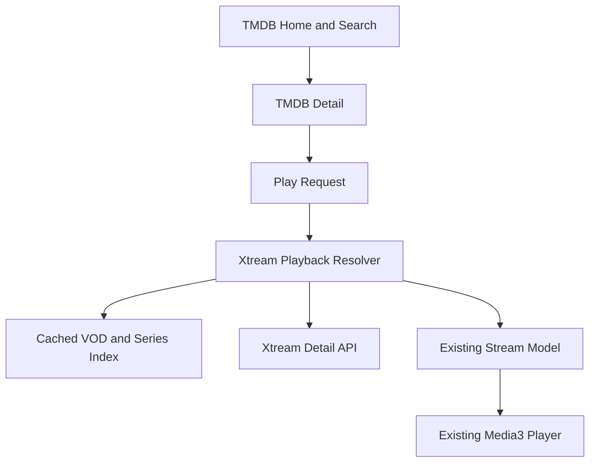

# Lume TMDB and Xtream MVP Design

**Spec**: `.specs/features/tmdb-xtream-mvp/spec.md`
**Status**: Approved from the conversation

## Architecture Overview

TMDB remains authoritative until the play action. A compact cached Xtream index is searched only by a playback resolver, which emits the existing `Stream` model so the mature Stream and Player screens remain reusable.



## Code Reuse Analysis

| Component | Location | How to Use |
| --------- | -------- | ---------- |
| TMDB API and metadata | `data/remote/api/TmdbApi.kt`, `core/tmdb/TmdbMetadataService.kt` | Add title search and episode generation. |
| TMDB collection resolver | `core/tmdb/TmdbCollectionSourceResolver.kt` | Produce direct Home rails. |
| Details UI | `ui/screens/detail/**` | Display synthetic TMDB `Meta` and generated `Video` values. |
| Stream and player UI | `ui/screens/stream/**`, `ui/screens/player/**` | Consume direct Xtream `Stream` values unchanged. |
| Local library and progress | `data/local/LibraryPreferences.kt`, `data/local/WatchProgressPreferences.kt` | Keep local implementations. |

## Components

### Build Configuration

- **Location**: `app/build.gradle.kts`, `local.example.properties`
- **Purpose**: Validate and expose TMDB/Xtream settings through `BuildConfig`.

### Xtream API

- **Location**: `data/remote/api/XtreamApi.kt`
- **Purpose**: Fetch authentication, VOD list/detail, series list/detail.
- **Security**: Dedicated OkHttp client without request logging or diagnostics breadcrumbs.

### Xtream Playback Resolver

- **Location**: `data/xtream/XtreamPlaybackResolver.kt`
- **Interfaces**:
  - `resolveMovie(tmdbId, titles, year): XtreamResolution`
  - `resolveEpisode(tmdbId, titles, year, season, episode): XtreamResolution`
- **Purpose**: Normalize candidates, verify movie TMDB IDs, reject ambiguous series, and build direct URLs.

### TMDB Catalog Source

- **Location**: existing TMDB API and Home/Search view models.
- **Purpose**: Return direct localized Home and search rows without addon dependencies.

### TMDB Episode Factory

- **Location**: `core/tmdb/TmdbMetadataService.kt`
- **Purpose**: Convert TMDB season responses into stable `Video` values.

## Data Models

```kotlin
data class XtreamVodItem(val streamId: Int, val title: String, val year: Int?, val extension: String?)
data class XtreamSeriesItem(val seriesId: Int, val title: String, val year: Int?)
sealed interface XtreamResolution {
    data class Available(val streams: List<Stream>) : XtreamResolution
    data object Unavailable : XtreamResolution
    data class Failure(val reason: String) : XtreamResolution
}
```

## Error Handling Strategy

| Error Scenario | Handling | User Impact |
| -------------- | -------- | ----------- |
| Valid lookup with no safe match | `Unavailable` | `Em breve` |
| Authentication/network/parsing failure | `Failure` | Retryable connection error |
| Ambiguous series match | Fail closed | `Em breve` |
| Stale index and refresh failure | Use stale compact index | Playback resolution remains available |
| Blank build credential | Gradle configuration failure | Build stops with named missing key |

## Risks & Concerns

| Concern | Location | Impact | Mitigation |
| ------- | -------- | ------ | ---------- |
| Xtream uses cleartext HTTP | build config and generated URLs | Credentials can be observed in transit | Personal-use disclosure; dedicated no-log client; never emit URL in errors. |
| Global Nuvio client disables TLS verification | `core/di/NetworkModule.kt` | Unsafe for secrets | Xtream gets a dedicated client; TMDB behavior is not broadened. |
| Series responses have no TMDB/IMDb ID | Xtream series API | False-positive playback | Exact normalized title plus year, alternate titles, ambiguity rejection, optional build-time overrides later. |
| VOD list has no TMDB ID | Xtream VOD list | N+1 API risk | Fetch details lazily only for normalized candidates. |
| Home is addon-centric | `HomeViewModelCatalogPipeline.kt` | TMDB rows are not direct | Resolve configured TMDB sources directly and bypass addon gates. |
| Working tree starts from a large upstream app | multiple | Broad deletion may break player | Remove legacy UX now; defer physical deletion of dormant internals. |

## Tech Decisions

| Decision | Choice | Rationale |
| -------- | ------ | --------- |
| Provider index persistence | Compact JSON file plus in-memory maps | 30k records are manageable without adding Room. |
| Playback integration | Existing `AddonStreams` envelope | Reuses selection, autoplay, cache, and player navigation. |
| Movie matching | Candidate normalization followed by exact detail `tmdb_id` | Prevents remakes and title collisions. |
| Series matching | Exact normalized title and exact year where available | Provider lacks external IDs, so unsafe fuzzy matching is rejected. |
| Package namespace | Keep Kotlin namespace initially; change application ID to `com.jeziel.lume` | Avoid touching thousands of imports while producing the requested install identity. |
